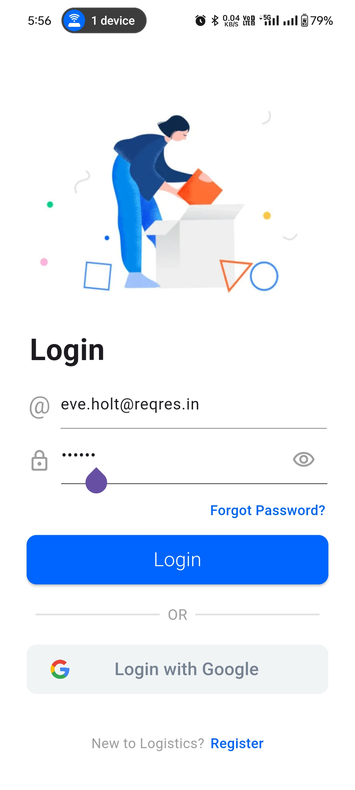
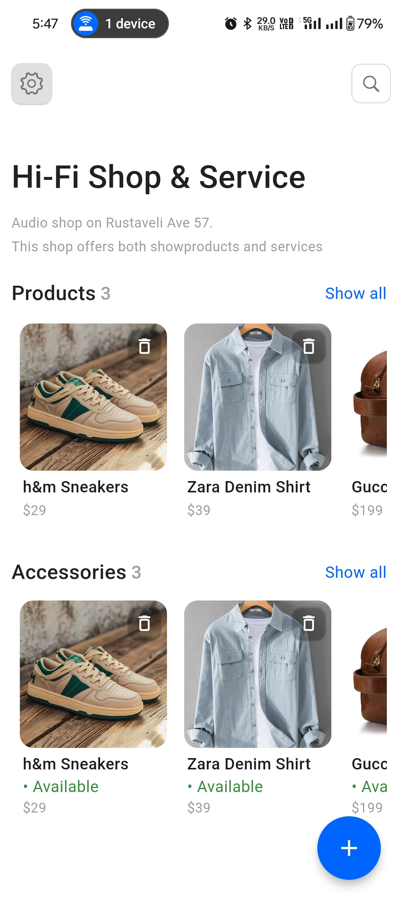
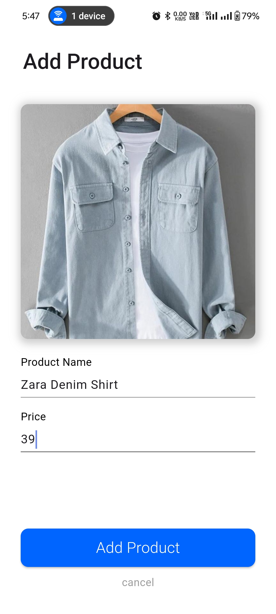
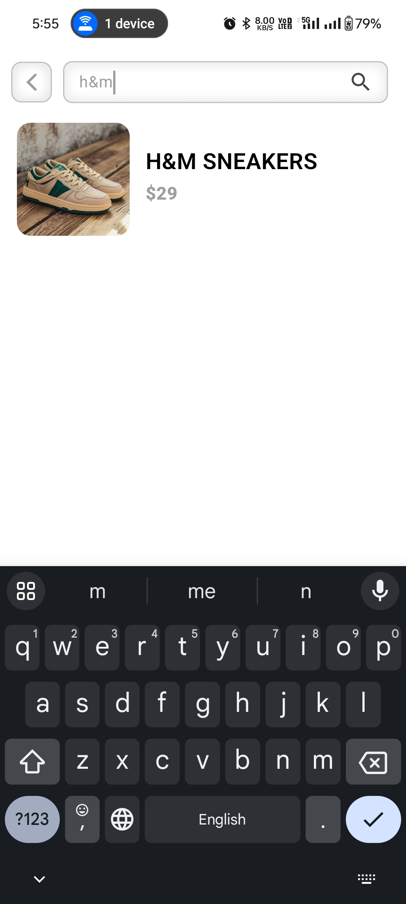

# Store App

this is a flutter app having features for user to login to app using the given email and password, to add/create products, show them in home screen, and to delete any product in home screen, and to search products by name in search page.the cross platform application development technology used in it is flutter which uses dart language and the packages used in it are : cupertino_icons,flutter_bloc,equatable,bloc_concurrency,shared_preferences,flutter_screenutil,flutter_spinkit,json_annotation & image_picker.

## Screenshots of Screens in App

| Splash Screen Page | Login Page | Home Page | Add Product Page | Product Search Page |
| ---------------------------- | ---------------- | ---------------- | ------------------------- | ---------------- |
|  |  |  |  |  |

## Features

- **Login functionality**
- **Routing to Home Screen Functionality if user is already logged in , using shared_preferences**
- **Home Screen to show products using shared_preferences**
- **Product Search Functionality using shared_preferences**
- **Add Product Functionality using shared_preferences**
- **Delete Product Functionality using shared_preferences**
